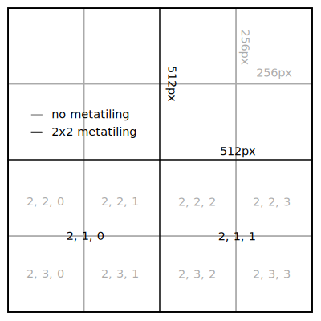
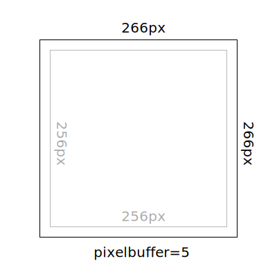

Tiling and projections
======================

This tool was intended to be used to preprocess data like creating hillshades
which is used for web maps afterwards. Therefore the output projections
supported are `Web Mercator`_ (``mercator``) and the geodetic projection based
on WGS84_ (``geodetic``). For the tiles within these projections, a tiling
scheme based on the WMTS_-tiling is used.

It is also possible to configure a fully custom tile pyramid with a custom coordinate
reference system.

.. _`Web Mercator`: https://epsg.io/3857
.. _WGS84: https://epsg.io/4326
.. _WMTS: https://en.wikipedia.org/wiki/Web_Map_Tile_Service

Tile pyramids
-------------

.. figure:: img/mercator_pyramid.svg

   standard ``mercator`` pyramid used in the web

Every tiling a web framework uses is based on a pyramid of multiple zoom levels
(tile matrices). Each tile matrix consists of tiles arranged in rows and
colums.

Every tile within a tile pyramid can be described by three numbers: the zoom
level, row and column. As these numbers are used in the WMTS protocol, Mapchete
can easily map them to the desired tiles to be processed.

Most web maps use the ``mercator`` scheme (or pyramid), the second most used
scheme is the ``geodetic`` scheme which also covers the polar regions but shows
distortions especially in higher lattitudes which are unfamiliar to most users.

Properties of supported pyramids
~~~~~~~~~~~~~~~~~~~~~~~~~~~~~~~~

=============   ============    =================
property        ``geodetic``    ``mercator``
=============   ============    =================
EPSG code       4326            3857
left            -180            -20037508.3427892
bottom          90              20037508.3427892
right           180             20037508.3427892
top             90              -20037508.3427892
zoom 0 rows     1               1
zoom 0 cols     2               1
=============   ============    =================

If you want to dig deeper into the topic, there is a more detailed description
on the `ẀMTS Simple`_ profile standard by the OGC.

.. _`ẀMTS Simple`: http://docs.opengeospatial.org/is/13-082r2/13-082r2.html

Internally, Mapchete uses tilematrix_, a python tool handling tiles and tile
pyramids. It is not planned to support other projections or tiling schemes yet,
but if there is demand and resources, tilematrix would be the starting point.

.. _tilematrix: https://github.com/ungarj/tilematrix

Metatiles
---------

   standard WMTS tiling versus ``metatiling=2``

Depending on the process it sometimes makes sense to increase the tile size.
A ``metatiling`` setting of 2 means that a metatile consists of 2x2 WMTS tiles.
Increasing the metatile size often also increases performance as some overhead
is reduced. However, having huge metatiles could also mean RAM is running out
at some point.

Mapchete lets you to specify which metatile size is being used when processing
the data and which size is used when writing the outputs. Please note that the
output tile size cannot be bigger than the process tile size.

Buffers
-------

   example tile with ``pixelbuffer=5``

Sometimes there can be artefacts on tile borders. This can be if the process
requires neighbor pixel values for every pixel (e.g. the hillshading algortihm)
or when reading raster data in some different projections.

In these cases, a ``pixelbuffer`` value can be set. This will enlarge each tile
on each side by the numbers of pixels specified. This option can be set for both
process tiles and output tiles. By default, the output tiles pixelbuffer is set
to 0, which means that when writing the process output, the buffer will be
cropped.

Please note that the **output** ``pixelbuffer`` cannot be larger than the
**process** ``pixelbuffer``.
